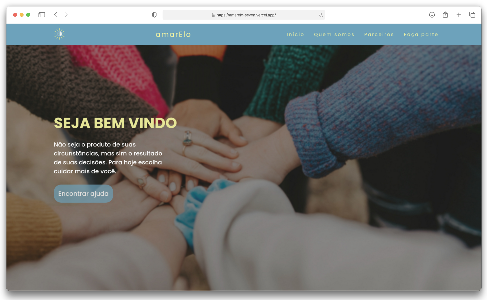

    <h1>amarElo 🧠</h1>
    

<h4 align="center"> 
    <a href="https://amarelo-seven.vercel.app/">Clique aqui para visualizar o projeto</a>
<h4>

## 💻 Sobre o projeto
amarElo é um projeto fictício com foco em saúde mental, desenvolvido durante o primeiro semestre da graduação (2024.1) como parte da disciplina de Desenvolvimento Front-end. A proposta do site é ser uma plataforma de acesso a serviços de psicoterapia, promovendo bem-estar e inoformação de forma acessível e acolhedora.

## 👩🏻‍💻 Funcionalidades
✅ Layout responsivo para diferentes tamanhos de tela;  
✅ Estilo visual leve e amigável, condizente com a temática de saúde mental.

## 🛠️ Tecnologias Utilizadas

Este projeto foi desenvlvido com as seguintes tecnologias e ferramentas:
* [Visual Studio Code](https://code.visualstudio.com/docs);
* [HTML](https://developer.mozilla.org/en-US/docs/Web/HTML);
* [CSS](https://developer.mozilla.org/en-US/docs/Web/CSS);
* [Javascript](https://developer.mozilla.org/en-US/docs/Web/JavaScript).

**Coded by [Ana Beatriz Arguelho](https://github.com/anabeatrizarguelho).**